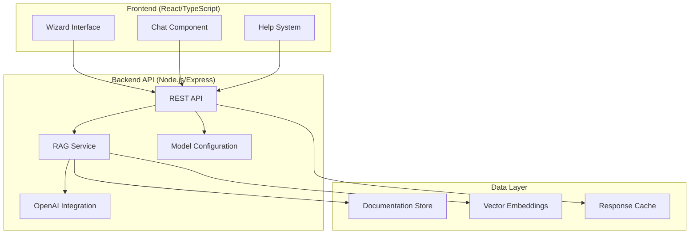

# Design Document

## Overview

The Onboarding Wizard is a documentation-driven guidance system that helps guide applicants navigate the ToursByLocals onboarding process. The system consists of a Node.js/Express API backend with RAG capabilities and a React/TypeScript frontend presenting a wizard-style interface. The system will be trained on onboarding documentation and provide contextual help through OpenAI integration.

## Architecture

### High-Level Architecture



### Technology Stack

**Backend:**
- Node.js with TypeScript
- Express.js framework
- OpenAI SDK (@ai-sdk/openai, ai)
- Vector database for embeddings (in-memory for POC)
- Pino for logging
- Jest for testing

**Frontend:**
- React 18 with TypeScript
- Modern React patterns (hooks, functional components)
- CSS modules or styled-components for styling
- Axios for API communication

## Components and Interfaces

### Backend Components

#### 1. RAG Service
```typescript
interface RAGService {
  initialize(documents: Document[]): Promise<void>;
  query(question: string, context?: string): Promise<RAGResponse>;
  updateDocuments(documents: Document[]): Promise<void>;
}

interface Document {
  id: string;
  title: string;
  content: string;
  section: OnboardingSection;
  metadata: Record<string, any>;
}

interface RAGResponse {
  answer: string;
  sources: DocumentSource[];
  confidence: number;
}
```

#### 2. OpenAI Integration Service
```typescript
interface OpenAIService {
  generateResponse(prompt: string, context: string[]): Promise<string>;
  generateEmbeddings(text: string): Promise<number[]>;
  setModel(model: string): void;
  getAvailableModels(): string[];
}
```

#### 3. Chat Service
```typescript
interface ChatService {
  processMessage(message: string, sessionId: string, context?: OnboardingContext): Promise<ChatResponse>;
  getConversationHistory(sessionId: string): Promise<ChatMessage[]>;
}

interface ChatResponse {
  message: string;
  suggestions?: string[];
  relatedSections?: OnboardingSection[];
}
```

#### 4. Configuration Service
```typescript
interface ConfigService {
  getModelConfiguration(): ModelConfig;
  updateModelConfiguration(config: ModelConfig): Promise<void>;
  validateModel(model: string): Promise<boolean>;
}

interface ModelConfig {
  chatModel: string;
  embeddingModel: string;
  temperature: number;
  maxTokens: number;
}
```

### Frontend Components

#### 1. Wizard Container
```typescript
interface WizardProps {
  onSectionSelect: (section: OnboardingSection) => void;
  currentSection?: OnboardingSection;
}

interface OnboardingSection {
  id: string;
  title: string;
  description: string;
  order: number;
  dependencies: string[];
  status: 'available' | 'current' | 'completed';
}
```

#### 2. Help System Component
```typescript
interface HelpSystemProps {
  section: OnboardingSection;
  onChatOpen: () => void;
}

interface HelpContent {
  title: string;
  content: string;
  examples?: string[];
  commonIssues?: string[];
}
```

#### 3. Chat Interface
```typescript
interface ChatProps {
  isOpen: boolean;
  onClose: () => void;
  context?: OnboardingContext;
}

interface ChatMessage {
  id: string;
  content: string;
  sender: 'user' | 'assistant';
  timestamp: Date;
  sources?: DocumentSource[];
}
```

## Data Models

### Core Data Structures

```typescript
// Onboarding sections based on the documentation
enum OnboardingSectionType {
  PROFILE = 'profile',
  PERSONAL_INFO = 'personal_info',
  PAYMENT = 'payment',
  TOURS = 'tours',
  CALENDAR = 'calendar',
  QUIZ = 'quiz'
}

interface OnboardingSection {
  id: OnboardingSectionType;
  title: string;
  description: string;
  requirements: string[];
  order: number;
  estimatedTime: string;
  helpContent: HelpContent;
}

interface OnboardingContext {
  currentSection?: OnboardingSectionType;
  userQuery?: string;
  sessionId: string;
}

interface DocumentSource {
  id: string;
  title: string;
  excerpt: string;
  section: OnboardingSectionType;
  relevanceScore: number;
}
```

### API Response Models

```typescript
interface APIResponse<T> {
  success: boolean;
  data?: T;
  error?: string;
  timestamp: Date;
}

interface SectionGuidanceResponse {
  section: OnboardingSection;
  guidance: HelpContent;
  relatedSections: OnboardingSection[];
}

interface ChatResponse {
  message: string;
  sources: DocumentSource[];
  suggestions: string[];
  sessionId: string;
}
```

## Error Handling

### Backend Error Handling
- Centralized error middleware for Express
- Structured error responses with appropriate HTTP status codes
- OpenAI API error handling with fallback responses
- RAG service error handling with graceful degradation
- Logging of all errors with context for debugging

### Frontend Error Handling
- Error boundaries for React components
- User-friendly error messages
- Retry mechanisms for API calls
- Fallback UI states for when services are unavailable
- Toast notifications for user feedback

### Error Types
```typescript
enum ErrorType {
  OPENAI_API_ERROR = 'openai_api_error',
  RAG_SERVICE_ERROR = 'rag_service_error',
  CONFIGURATION_ERROR = 'configuration_error',
  VALIDATION_ERROR = 'validation_error',
  NETWORK_ERROR = 'network_error'
}

interface AppError {
  type: ErrorType;
  message: string;
  details?: any;
  timestamp: Date;
}
```

## Testing Strategy

### Backend Testing
- Unit tests for all services using Jest
- Integration tests for API endpoints
- Mock OpenAI API responses for consistent testing
- RAG service testing with sample documents
- Configuration service testing with various model configurations

### Frontend Testing
- Component testing with React Testing Library
- User interaction testing for wizard navigation
- Chat interface testing with mock responses
- Error state testing for all components
- Accessibility testing for wizard interface

### Test Coverage Requirements
- Minimum 80% code coverage for backend services
- All API endpoints must have integration tests
- Critical user flows must have end-to-end tests
- Error scenarios must be tested for all components

### Testing Tools
- Jest for unit and integration testing
- React Testing Library for component testing
- Supertest for API endpoint testing
- MSW (Mock Service Worker) for API mocking in frontend tests

## Performance Considerations

### Backend Performance
- Response caching for frequently asked questions
- Efficient vector similarity search for RAG
- Connection pooling for external API calls
- Request rate limiting to prevent abuse
- Lazy loading of documentation embeddings

### Frontend Performance
- Code splitting for wizard sections
- Lazy loading of chat component
- Debounced search for help queries
- Optimized re-renders with React.memo
- Efficient state management to prevent unnecessary updates

### Scalability Considerations
- Stateless API design for horizontal scaling
- Configurable model selection for cost optimization
- Modular architecture for easy feature additions
- Separation of concerns for maintainability